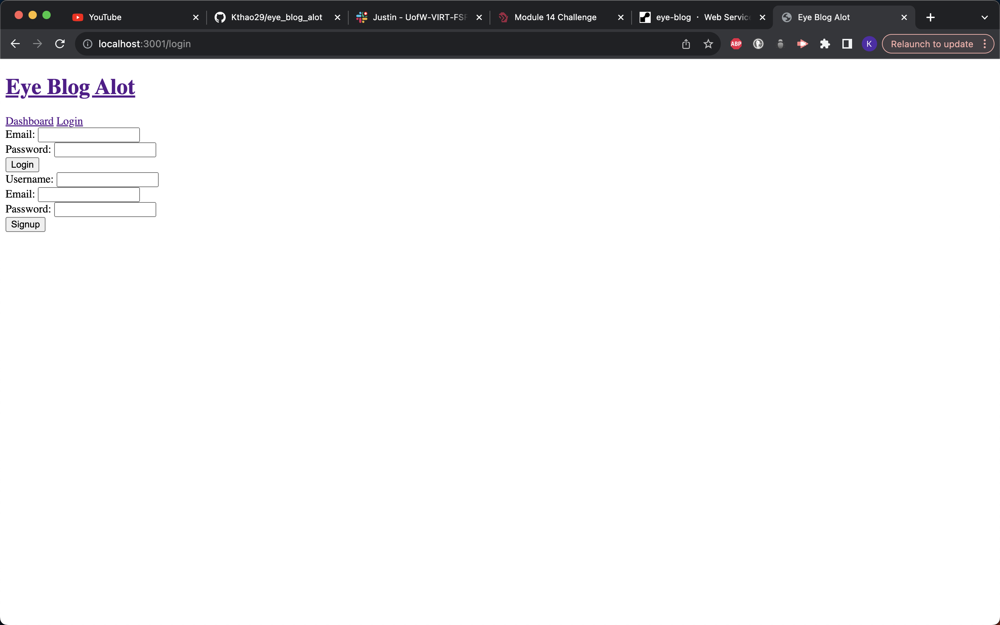
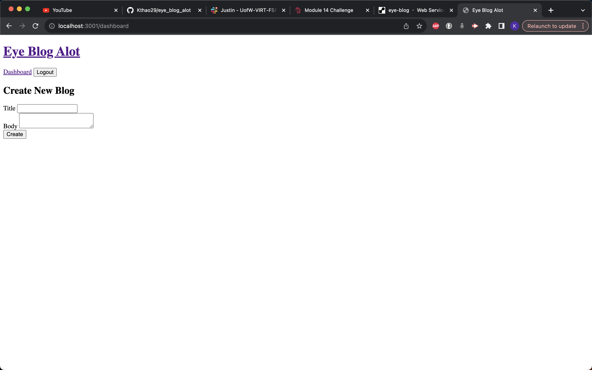
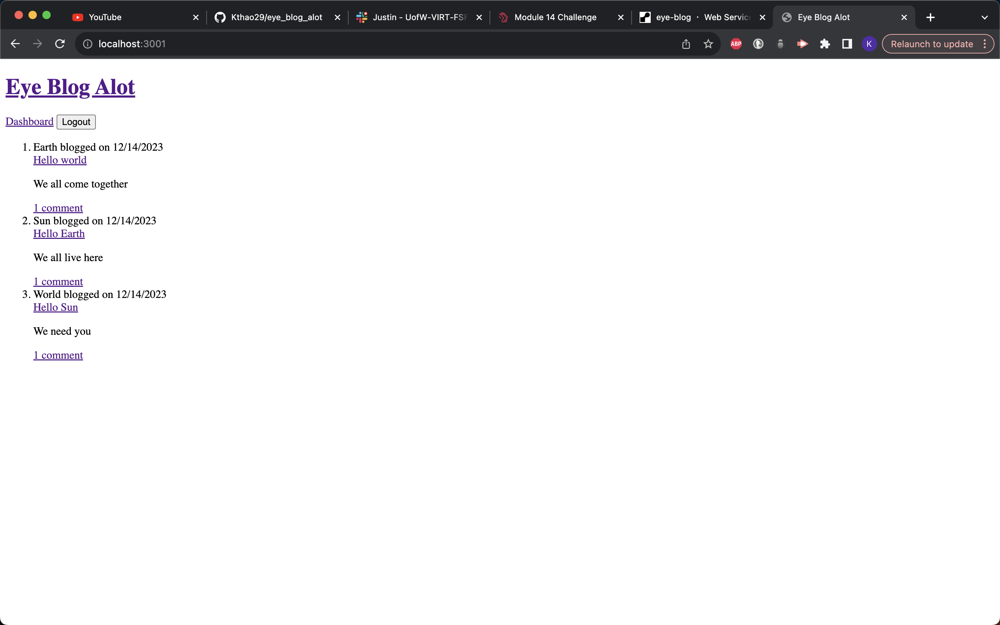
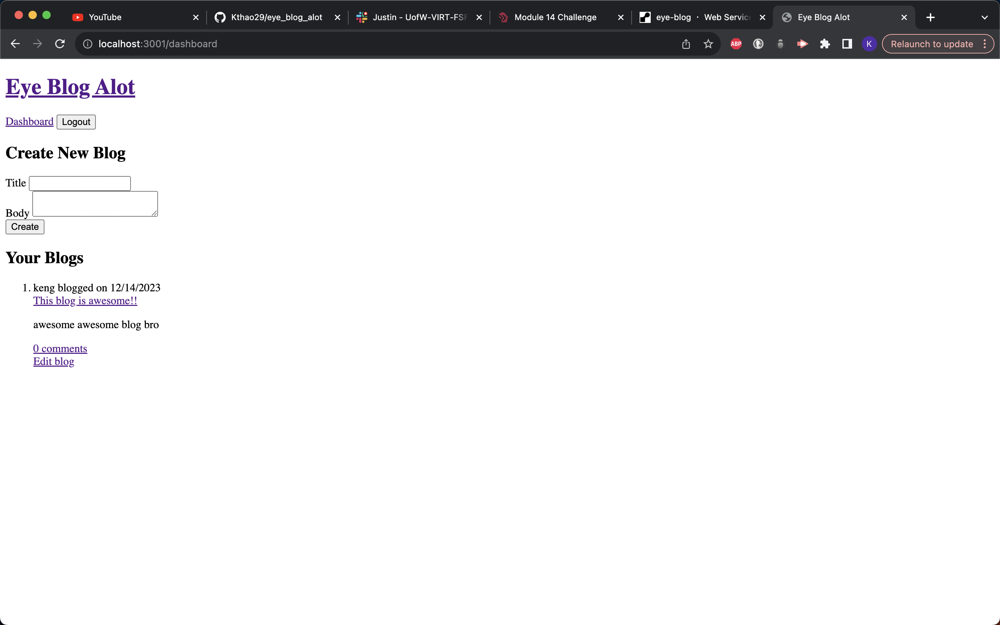
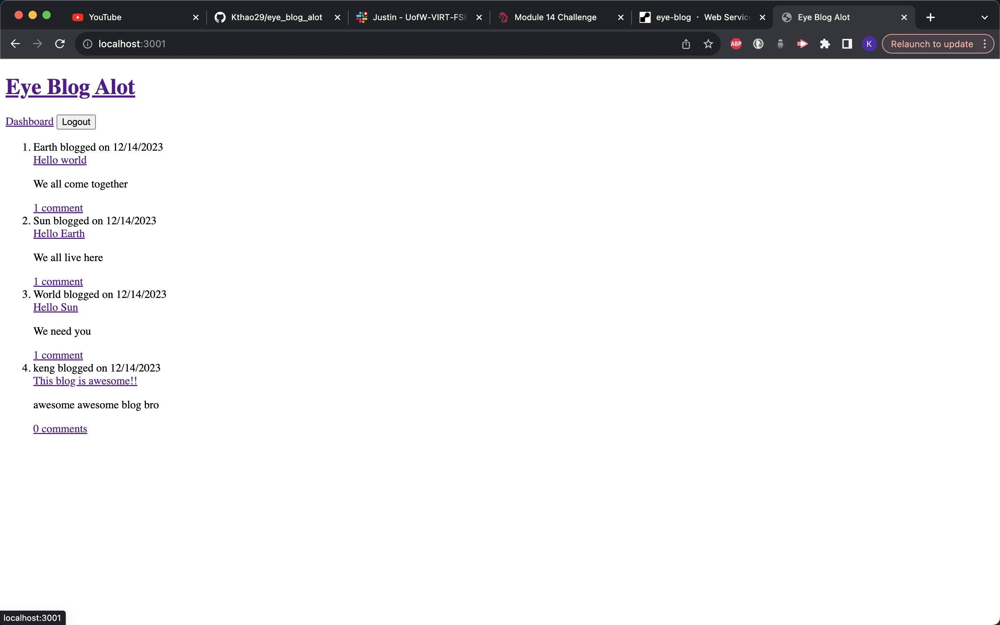

# EYE_BLOG_ALOT

## Description

A lot of people love reading other people's stories online nowadays and it is a way of them getting to experience what the other person is going through. There are all kinds of different blogs that are posted online daily. This app is built to help others share and write their blogs for other users to read. You can make comments to other people's blogs and they can also do it to yours.

## User Story

AS A developer who writes about tech

I WANT a CMS-style blog site

SO THAT I can publish articles, blog posts, and my thoughts and opinions

## Acceptance Criteria

GIVEN a CMS-style blog site

WHEN I visit the site for the first time

THEN I am presented with the homepage, which includes existing blog posts if any have been posted; navigation links for the homepage and the dashboard; and the option to log in

WHEN I click on the homepage option

THEN I am taken to the homepage

WHEN I click on any other links in the navigation

THEN I am prompted to either sign up or sign in

WHEN I choose to sign up

THEN I am prompted to create a username and password

WHEN I click on the sign-up button

THEN my user credentials are saved and I am logged into the site

WHEN I revisit the site at a later time and choose to sign in

THEN I am prompted to enter my username and password

WHEN I am signed in to the site

THEN I see navigation links for the homepage, the dashboard, and the option to log out

WHEN I click on the homepage option in the navigation

THEN I am taken to the homepage and presented with existing blog posts that include the post title and the date created

WHEN I click on an existing blog post

THEN I am presented with the post title, contents, post creator’s username, and date created for that post and have the option to leave a comment

WHEN I enter a comment and click on the submit button while signed in

THEN the comment is saved and the post is updated to display the comment, the comment creator’s username, and the date created

WHEN I click on the dashboard option in the navigation

THEN I am taken to the dashboard and presented with any blog posts I have already created and the option to add a new blog post

WHEN I click on the button to add a new blog post

THEN I am prompted to enter both a title and contents for my blog post

WHEN I click on the button to create a new blog post

THEN the title and contents of my post are saved and I am taken back to an updated dashboard with my new blog post

WHEN I click on one of my existing posts in the dashboard

THEN I am able to delete or update my post and taken back to an updated dashboard

WHEN I click on the logout option in the navigation

THEN I am signed out of the site

WHEN I am idle on the site for more than a set time

THEN I am able to view posts and comments but I am prompted to log in again before I can add, update, or delete posts

## Screenshots

## Usage/Installation

1. npm init
2. install sequelize
3. install express
4. install dotenv
5. mysql -u root -p
6. source db/schema.sql and then control z to exit mysql
7. npm run seed
8. npm start
9. deploy it into render

## Credits

1. VS Code
2. render
3. sequelize
4. express
5. dotenv
6. github
7. handlebars/express-handlebars
8. connection session-sequelize
9. UW class activities

## Author

My Github account: https://github.com/Kthao29
